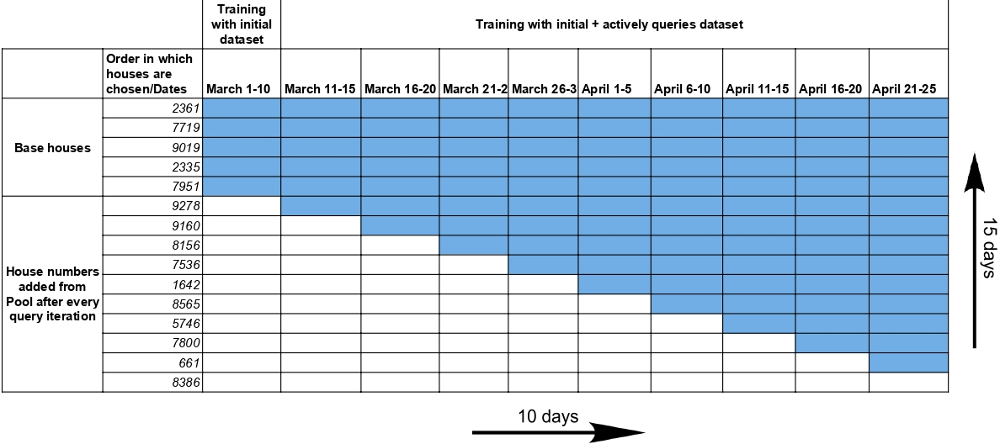

# Rank

  

The amount of data used for training during the active learning loop and base training is marked in blue color. The total number of houses were 15 and a total of 10 iterations were performed.

Thus total data boxes = $15*10 = 150$.

For the five base houses, all data is used for training eventually so: $5*10=50$. For rest houses we add the boxes as follows: $9+8+7+.....+1=45$. Thus 95 boxes of training data is used.

In % terms this amounts to: 

$\frac{95}{150}*100 \sim 65\%$. Thus we make use of 65% data as compared to using the entire dataset.